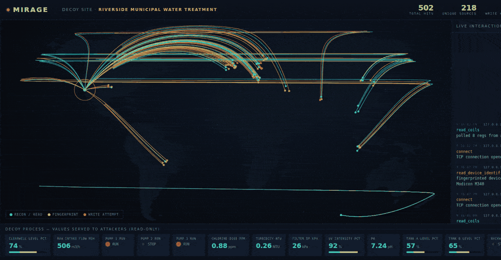
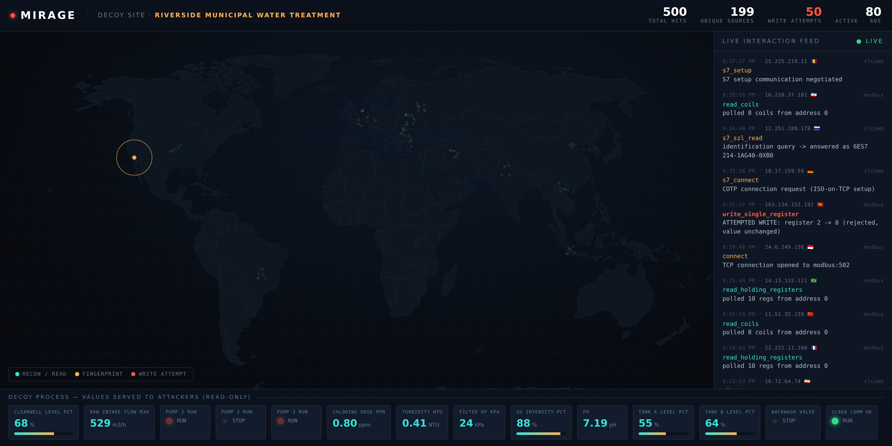

# Mirage



**Deploy a fake industrial plant in 30 seconds. Watch real attackers hit it on a live world map.**

Mirage is a low-interaction OT/ICS honeynet. It stands up convincing decoys of the
industrial protocols that scanners and intrusion sets probe every day — Modbus TCP
and Siemens S7 — gives them a *living* fake process to poke at, and streams every
interaction onto a SCADA-style console with a real-time attack map.

Nothing real is ever exposed. The decoys answer reads with synthetic process values
and acknowledge writes **without ever applying them**, so an attacker trying to stop
a pump gets a perfectly normal "OK" while you record exactly what they tried to do.

```
   recon ─▶  [ Modbus :502 ]  ─┐
                               ├─▶  capture + enrich  ─▶  SQLite  ─▶  live console
   recon ─▶  [  S7   :102 ]  ─┘                                         (world map)
```

---

## Why

The internet is full of HTTP honeypots and almost nothing for the protocols that run
water plants, substations, and factories. Meanwhile Modbus/502 and S7/102 get scanned
around the clock. Mirage exists to make standing an ICS sensor trivial: one command,
a believable plant, and a map that turns background noise into something you can
actually watch, brief, and learn from.

It is built for blue teams, OT security researchers, and anyone who wants ground-truth
on who is knocking on industrial ports.

## Quickstart

**Docker (recommended):**

```bash
docker compose up --build
# dashboard:        http://localhost:3000
# modbus decoy:     tcp/502
# s7 decoy:         tcp/102
```

**From source:**

```bash
pip install -r requirements.txt
python run.py
```

Want to see it fill up before exposing anything? Seed demo data and open the console:

```bash
python scripts/seed_demo.py --count 600     # fabricated events, presentation only
python run.py --dash-only
```

Or drive the live decoys locally:

```bash
python run.py &                 # start everything
python scripts/attacker_sim.py  # trickle real protocol traffic at 127.0.0.1
```

## What it captures

Every interaction is stored with a timestamp, source IP, geolocation, the decoded
action, and the raw bytes. Three severities make the signal obvious:

| Severity | Meaning | Examples |
|----------|---------|----------|
| `info`   | Passive reconnaissance | register/coil polls |
| `notice` | Active fingerprinting & sessions | connect, device-ID read, S7 setup, SZL query |
| `high`   | Control attempts | any write to a register, coil, or data block |

A `high` event means someone moved past looking and tried to *change* the process.
Those are the ones worth a page.

## The decoys

**Modbus TCP** — full MBAP framing; answers read functions from a live register map;
echoes writes like a real PLC while discarding them; responds to *Read Device
Identification* (FC 0x2B/0x0E) so scanners fingerprint it as a specific vendor.

**Siemens S7comm** — the real ISO-on-TCP stack (TPKT → COTP → S7). Completes the
connection handshake, negotiates setup communication, and answers SZL identification
queries with a believable module order number.

What the decoy *is* comes from a **persona**. The bundled one is a municipal
water-treatment plant with tank levels, pump states, chlorine dosing, turbidity, and
pH — values that drift over time so a returning scanner sees a process that is alive,
not a static stub. Personas live in `mirage/personas/`; add your own to mimic a
substation, a packaging line, or a building-automation controller.

## The console



A single dark SCADA-style page:

- **Live attack map** — every source arcs toward the plant; colour encodes intent
  (recon / fingerprint / write attempt). The world basemap is bundled, so the map
  makes no external calls.
- **Interaction feed** — a running, colour-coded stream of exactly what each source did.
- **Process mimic** — the decoy plant's own gauges and pump lamps, updating live. You
  watch the attacker *and* the fake process they think they're touching, side by side.

## Architecture

```
                         ┌───────────────────────────────┐
   attacker ──▶ :502 ──▶ │  Modbus decoy                 │
   attacker ──▶ :102 ──▶ │  S7 decoy                     │──▶ event bus ─┬─▶ SQLite
                         │  (asyncio listeners)          │               │
                         └───────────────────────────────┘               │
                                                                          ▼
                         ┌───────────────────────────────┐   websocket  ┌──────────┐
                         │  dashboard (FastAPI)           │ ◀──────────  │ console  │
                         │  REST + /ws live feed          │ ───────────▶ │ (browser)│
                         └───────────────────────────────┘              └──────────┘
```

Everything runs in one process on one asyncio loop. No external services, no message
broker, no cloud. Storage is a single SQLite file you can copy off and analyse.

## Deployment notes

- Place decoys where recon would plausibly reach them — an OT DMZ, a screened segment,
  or a public IP set aside as a sensor. **Never inline** with real equipment.
- Standard ports (502/102) make the trap convincing. Binding them needs privilege; the
  Docker setup handles the port mapping for you. To run unprivileged, set
  `MIRAGE_MODBUS_PORT` / `MIRAGE_S7_PORT` to high ports and remap at the firewall.
- The sensor is **low-interaction by design**. It never proxies, forwards, or executes
  anything an attacker sends — it only ever replies with synthetic data.

## Configuration

All via environment variables (see `mirage/config.py`):

| Variable | Default | Purpose |
|----------|---------|---------|
| `MIRAGE_BIND` | `0.0.0.0` | decoy bind address |
| `MIRAGE_MODBUS_PORT` / `MIRAGE_S7_PORT` | `502` / `102` | decoy ports |
| `MIRAGE_DASH_PORT` | `3000` | dashboard port |
| `MIRAGE_PERSONA` | `water_treatment` | which fake plant to present |
| `MIRAGE_GEOIP` | `1` | enrich sources with geolocation |
| `MIRAGE_DB` | `mirage.db` | SQLite path |

## Responsible use

Honeypots are deception tools. Run Mirage only on infrastructure you own or are
explicitly authorised to operate, capture only traffic that comes to your own sensor,
and check the rules in your jurisdiction before collecting or retaining source data.
Mirage is passive: it waits to be probed and records what arrives. Don't point it at
anyone, and don't use it to bait or entrap.

## Roadmap

- More decoys: DNP3, EtherNet/IP (CIP), BACnet, IEC 60870-5-104
- Threat-intel export: STIX 2.1 and MISP feeds from captured sources
- Persona builder: generate a decoy from a real device's identity profile
- Optional fully-vendored UI for air-gapped analyst stations
- Alerting hooks (syslog / webhook) on `high` events

## License

MIT — see [LICENSE](LICENSE).
